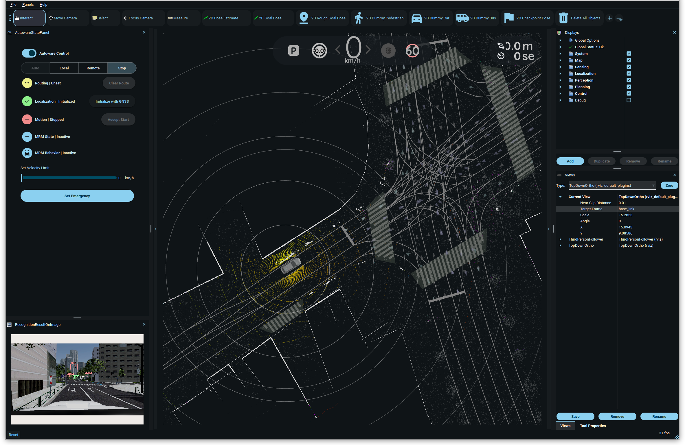

## Extended Autoware v0.41.2
This repository is a fork of Autoware, extended from [Autoware v0.41.2](https://github.com/autowarefoundation/autoware/releases/tag/0.41.2) with the following modifications:

- **New AEB service interface**.
Added a ROS 2 service interface that allows ROS clients to trigger Autonomous Emergency Braking (AEB).
The modified implementation can be found in the [src/universe/autoware.universe/control/autoware_autonomous_emergency_braking](src/universe/autoware.universe/control/autoware_autonomous_emergency_braking) package, particularly in the [src/universe/autoware.universe/control/autoware_autonomous_emergency_braking/src/node.cpp](src/universe/autoware.universe/control/autoware_autonomous_emergency_braking/src/node.cpp) file.
For comparison, the original implementation is available in the [Autoware Universe repo](https://github.com/autowarefoundation/autoware_universe/tree/main/control/autoware_autonomous_emergency_braking).

- **New `aw_monitor` package**.
Added the [src/aw_monitor package](src/aw_monitor/) package to support the implementation of AW-Runtime-Monitor. This package introduces new `msg` and `srv` definitions for custom message formats.

- **Modified default planning parameters**. 
Updated the default parameter configuration for autonomous driving in [src/launcher/autoware_launch/autoware_launch/config/planning/scenario_planning/common/common.param.yaml](src/launcher/autoware_launch/autoware_launch/config/planning/scenario_planning/common/common.param.yaml).
In the original configuration ([reference](https://github.com/autowarefoundation/autoware_launch/blob/main/autoware_launch/config/planning/scenario_planning/common/common.param.yaml)), the default deceleration and jerk limits are set to 2.5 m/s2 and 1.5 m/s3, which are too small.
We increase them to 8.33 m/s2 (0.85 G) and 83.3 m/s3, following the JAMA standard.


### Installation
The hardware requirements are listed here:
https://autowarefoundation.github.io/AWSIM-Labs/main/GettingStarted/QuickStartDemo/#pc-specs

To run an end-to-end Autoware simulation with the [AWSIM-Labs simulator](https://github.com/dtanony/AWSIM-Labs), a PC equipped with a GPU is required.
Because of the specific GPU driver and CUDA dependencies, a pre-built binary release of Autoware is not available for this setup.
Therefore, if you want to run an end-to-end simulation with AWSIM-Labs, the only option is to build Autoware from source.
To install AWSIM-Labs, follow the instructions on its [repository](https://github.com/dtanony/AWSIM-Labs).

To install and launch this extended Autoware version, follow the procedure below (adapted from https://autowarefoundation.github.io/AWSIM-Labs/main/GettingStarted/QuickStartDemo and https://autowarefoundation.github.io/autoware-documentation/main/installation/autoware/source-installation/).

1. Download `map files (pcd, osm)` from [here](https://github.com/tier4/AWSIM/releases/download/v1.1.0/nishishinjuku_autoware_map.zip) and unzip the file
to some location, for example, `~/autoware_map`

2. Clone this repo.

```bash
cd ~
git clone https://github.com/dtanony/autoware0412.git autoware
cd autoware
```

3. Configure the environment. (Skip if Autoware environment has been configured before)
```
./setup-dev-env.sh
```

4. Install dependent ROS packages.
```
source /opt/ros/humble/setup.bash
rosdep update
rosdep install -y --from-paths src --ignore-src --rosdistro $ROS_DISTRO
```

5. Build the workspace.
```
colcon build --symlink-install --cmake-args -DCMAKE_BUILD_TYPE=RelWithDebInfo -DCMAKE_EXPORT_COMPILE_COMMANDS=1
```

6. Launch Autoware.
```
source install/setup.bash
ros2 launch autoware_launch e2e_simulator.launch.xml vehicle_model:=awsim_labs_vehicle sensor_model:=awsim_labs_sensor_kit map_path:=<absolute path of map folder> launch_vehicle_interface:=true

# Use the absolute path for the map folder, don't use the ~ operator.

# Example:
ros2 launch autoware_launch e2e_simulator.launch.xml vehicle_model:=awsim_labs_vehicle sensor_model:=awsim_labs_sensor_kit map_path:=/home/your_username/autoware_map/nishishinjuku_autoware_map launch_vehicle_interface:=true
```
The screen looks like this (after connected with AWSIM-Labs)


If any build issues occur, refer to the [Troubleshooting guide](https://autowarefoundation.github.io/autoware-documentation/main/support/troubleshooting/#build-issues).
